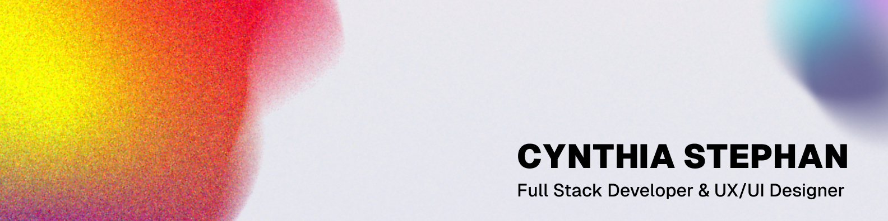

 

# Hello, moi c'est Cynthia 🤗

Mon parcours vers le développement web s'est construit autour de ma double passion pour l'art et la technologie. J'ai débuté par le design UI/UX, captivée par la création d'interfaces intuitives qui améliorent l'expérience utilisateur. Cette curiosité pour l'aspect technique m'a naturellement menée vers le développement.

## 🌱 Mon parcours, étape par étape :
- **UI/UX Designer** : La création d'interfaces intuitives m'a appris l'importance d'une expérience utilisateur bien pensée.
- **Développement Front-End** : J'ai appris à donner vie aux designs, en créant des interfaces interactives et fonctionnelles.
- **Développement Back-End** : En formation à l'IMTS de Dinard, j'explore l'architecture des applications et la gestion des données.

## 🎯 Ce que je recherche
Actuellement, je suis à la recherche d'une **alternance en tant que développeuse Fullstack** pour approfondir mes compétences, m'immerger dans des projets concrets, et évoluer au sein d'une équipe. 

## 😎 Ma vision
J'adore l'idée de fusionner le design et le développement pour créer des expériences complètes et engageantes. Mon but ? Concevoir des applications qui sont non seulement belles et intuitives, mais aussi robustes et adaptées aux besoins réels des utilisateurs.
Chaque étape du processus de l'idée initiale au déploiement est une opportunité d'apprentissage et de création.

## 💻 Mes compétences

### Front-End

### Back-End

### Outils

### Design

## 📚 J'apprends actuellement
Je me concentre actuellement sur l'apprentissage des technologies suivantes : `Symfony` `Java`

## ✨ Mes projets récents
Voici quelques projets sur lesquels j'ai travaillé :

### [⚡En cours ] **[Portfolio](https://github.com/CynthiaStephan/portfolio)**   `React` `JavaScript` `OGL` `Gsap` `Mobile First`
   J'ai réalisé ce portfolio pour mettre en avant mes projets et compétences. C’était également l’opportunité d’explorer des technologies créatives comme OGL et GSAP.

### **[PawCalypse](https://github.com/CynthiaStephan/Pawcalypse)** `Php` `Twig` `Docker` `Composer`
   Le projet Pawcalypse consiste à refactoriser une application existante en adoptant une architecture MVC (Modèle-Vue-Contrôleur) et une approche orientée objet (POO). L'objectif est de structurer le code de manière modulaire et maintenable.

### **[NotiMail](https://github.com/CynthiaStephan/NotiMail)** `React` `Router Dom` `API`
   C'est un projet de gestion de courrier réalisé en groupe au cours de ma formation.
   J'ai intégré les éléments visuels et connecté l'application à l'API pour la gestion des données.

## 📬 Où me trouver
- **Email** : [cynthia.stephan@institutsolacroup.com](mailto:cynthia.stephan@institutsolacroup.com)
- **LinkedIn** : [linkedin.com/in/cynthia-stephan](https://www.linkedin.com/in/cynthia-stephan/)
- **Portfolio** : [cynthia.errhub404.fr](https://cynthia.errhub404.fr/)
